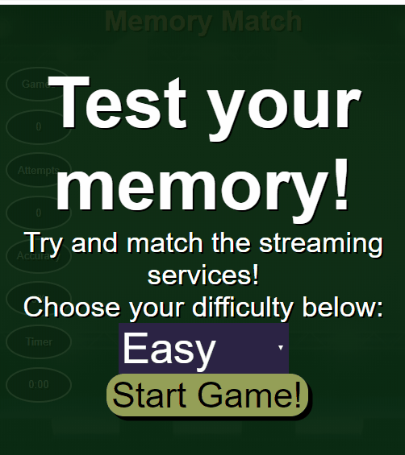

# Memory Match

## Description
Memory Match is a simple card matching game stylized to include popular music streaming providers.

## Live Website
Try the application live at [https://memory-match.lawrkim.com](https://memory-match.lawrkim.com)

## Technologies Used
- HTML5
- CSS3
- JavaScript
- AWS EC2

## Features
- Players can choose a difficulty
- Players can flip and match cards
- Players can view their stats
- Players can play the game again at the same or different difficulty

## Preview

